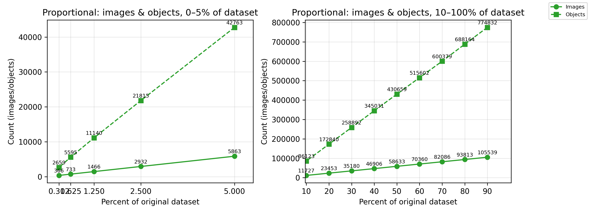
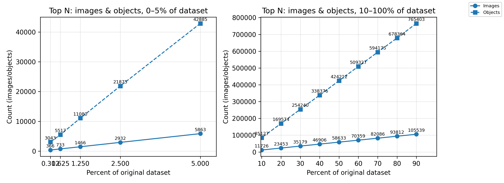
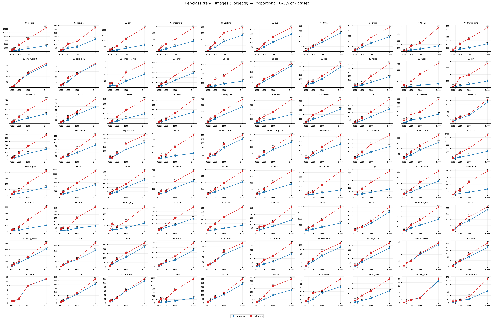
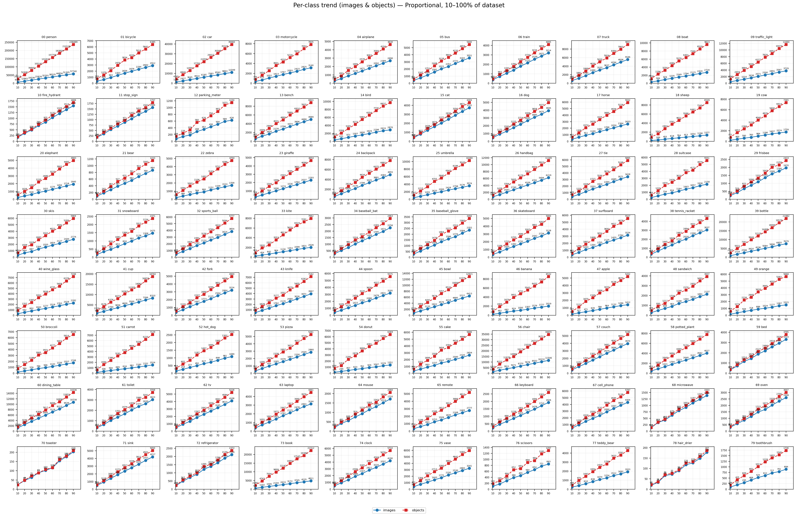
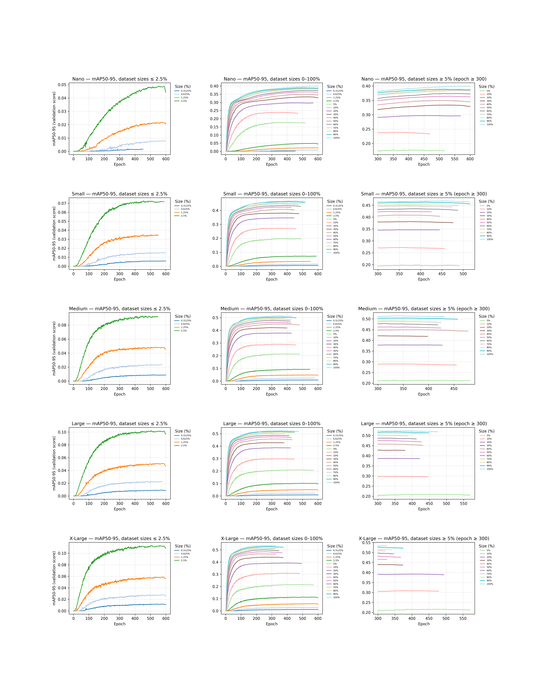
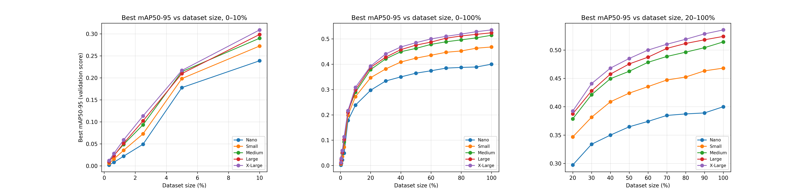

# YOLOv12 Small-Data Investigation  
### Full Analysis of Training YOLOv12 on Extremely Small COCO Subsets

---

## 📌 Project Overview

This repository presents a complete study of **how YOLOv12 behaves when trained on very small subsets of the COCO dataset**—from **0.3125% up to 100%** of COCO train2017.

The primary research goals were:

- to understand **how dataset size affects accuracy**,  
- to evaluate **stability of training** on extremely small datasets,  
- to compare **five YOLOv12 model sizes (n, s, m, l, x)**,  
- to measure **training time and convergence behavior**,  
- and to analyze **class distribution retention** under proportional subsampling.

All experiments were run on the **Leonardo Supercomputer**:

- 4 compute nodes  
- 4× GPUs per node  
- **16 GPUs total**  
- Distributed training via SLURM  

The full experimental pipeline — dataset creation, training scripts, subset analysis, and visualization — is included and fully reproducible.

---

# 📁 Dataset Construction

## Step 1 — Removing Empty Images

Before building any reduced dataset, we scanned the full COCO train2017 list and **removed all images with zero annotated objects**.

This ensures that proportional sampling does not select empty samples and maintains valid class statistics in every subset.

The cleaned image list was used as the base source for proportional subset generation.

---

## Step 2 — Subsampling Strategies

Each dataset percentage was generated using **three strategies**:

### 🔷 1. **Proportional (P)** — *Class-balanced subsampling (used for training)*  
This method preserves class proportions by sampling images so that every COCO class is represented according to the original class frequency.

```
train2017_<percent>_p.txt
```

This is the **main dataset type used for all YOLOv12 training** in this study.

---

### 🔶 2. Random  
Uniform random selection of images.

```
train2017_<percent>_random.txt
```

---

### 🔷 3. Top-N  
Takes the first N samples from the filtered COCO list.  
Not class-balanced, included only for comparison.

```
train2017_<percent>_topn.txt
```

---

## Step 3 — Available Dataset Sizes

The following dataset sizes were generated:

```
0.3125%, 0.625%, 1.25%, 2.5%, 5%, 10%, 20%, 30%, 40%, 50%, 60%, 70%, 80%, 90%, 100%
```

All subset files are located in:

```
datasets/
```

Additional aggregated class statistics are located here:

```
datasets/class_distribution.csv
```

---

# 📉 Dataset Analysis & Distribution Plots

Below are the main visualizations showing how the dataset shrinks at different scales.

### **Overall images & objects (Proportional / Random / Top-N)**





---

### **Per-Class Trends for Proportional Sampling**

These plots show how each of the 80 COCO classes is reduced proportionally.

#### 0–5% Range


#### 10–100% Range


---

# 🧪 YOLOv12 Training Experiments

We trained the following model sizes:

```
YOLOv12-n
YOLOv12-s
YOLOv12-m
YOLOv12-l
YOLOv12-x
```

Each model was trained on **all 15 dataset scales**, using the official YOLOv12 distributed training procedure.

Training logs are stored in:

```
small_data_logs/
```

---

# 📈 Training Behavior & Performance

## mAP5095 vs Epoch  
(Overview grid for all models across dataset sizes)



---

## Best mAP vs Dataset Size



---

# 📊 Final Results Summary

### ❗ DO NOT MERGE INTO MAIN UNTIL THIS SECTION IS FILLED 
**Insert the final mAP values for each model and each dataset percentage.**

```
|   Dataset % |   YOLOv12-n |   YOLOv12-s |   YOLOv12-m |   YOLOv12-l |   YOLOv12-x |
|-------------|-------------|-------------|-------------|-------------|-------------|
|      0.3125 |     0.00177 |     0.00585 |     0.00896 |     0.00912 |     0.01189 |
|      0.625  |     0.00793 |     0.01524 |     0.02366 |     0.02285 |     0.02798 |
|      1.25   |     0.02178 |     0.03515 |     0.0485  |     0.05101 |     0.05882 |
|      2.5    |     0.04893 |     0.07254 |     0.09322 |     0.10207 |     0.11329 |
|      5      |     0.17771 |     0.19822 |     0.21405 |     0.20958 |     0.21669 |
|     10      |     0.23863 |     0.27215 |     0.28986 |     0.29841 |     0.30878 |
|     20      |     0.29715 |     0.34674 |     0.37859 |     0.38737 |     0.39227 |
|     30      |     0.33377 |     0.38143 |     0.42123 |     0.4279  |     0.44073 |
|     40      |     0.34988 |     0.40865 |     0.44943 |     0.4575  |     0.46805 |
|     50      |     0.36457 |     0.42395 |     0.46249 |     0.47544 |     0.48505 |
|     60      |     0.37409 |     0.43547 |     0.47834 |     0.48741 |     0.49991 |
|     70      |     0.38462 |     0.44713 |     0.48865 |     0.50288 |     0.51019 |
|     80      |     0.38729 |     0.45238 |     0.4962  |     0.51158 |     0.519   |
|     90      |     0.38902 |     0.46326 |     0.50416 |     0.51805 |     0.52846 |
|    100      |     0.39996 |     0.46807 |     0.51434 |     0.52403 |     0.53549 |
```

---

# 📦 Repository Structure (Simplified)

```
yolov12_SmallData/
│
├── datasets/  
│   ├── train2017_<percent>_p.txt  
│   ├── train2017_<percent>_random.txt  
│   ├── train2017_<percent>_topn.txt  
│   └── class_distribution.csv
│
├── plots/
│   ├── datasets/    # Dataset distribution plots
│   └── train/       # Training curves and evaluation charts
│
├── small_data_logs/  # YOLOv12 training logs
└── README.md
```

---

## ⬜ TEMPLATE: Reproducing Official YOLO Results

**Goal:** Show that our training pipeline reproduces the original YOLOv12 results closely enough (within a few percentage points), and only then move on to small-data experiments.

Tasks for this section:

1. **Compare our full-data runs to the official YOLOv12 results.**  
   - For each model size (n, s, m, l, x), collect:  
     - our best mAP50-95 on the full 100% dataset,  
     - the corresponding official mAP from the YOLOv12 paper or repository.

2. **Plot per-model comparison curves.**  
   - Create a figure with 5 subplots in a single row (one subplot per model size).  
   - For each model, show our training curve vs. the reference curve or reported best point from the authors.  
   - Visually highlight how close our results are to the official ones.

3. **Create a comparison table.**  
   - Table with columns: Model, Our best mAP50-95, Official mAP50-95, Absolute difference (Δ), Relative difference (%).  
   - Expect differences of only a few percentage points.  
   - Conclude that the reproduction is successful if deviations stay in that small range.

4. **Write a short textual conclusion.**  
   - Explain that our training reliably reproduces the authors’ performance on the full dataset.  
   - Based on this, justify moving to small-data experiments.

**THIS ENTIRE SUBSECTION MUST BE WRITTEN BY HAND ONCE OFFICIAL REFERENCE NUMBERS AND OUR FINAL NUMBERS ARE AVAILABLE.**

---

## ⬜ TEMPLATE: Small-Data Results and Interpretation

**Goal:** Describe how performance changes as the amount of training data is reduced and provide hypotheses for why the behavior is not strictly linear.

Tasks for this section:

1. **Describe overall trends.**  
   - Explain how mAP50-95 changes as we move from 100% → 50% → 20% → 10% → 5% → 2.5% → ...  
   - Comment that **cutting the dataset size in half does not necessarily halve the performance** — the degradation is slower and model performance remains surprisingly robust even at smaller scales.

2. **Highlight interesting regimes.**  
   - Identify thresholds where performance drops more sharply (e.g., below 5% or 1.25%).  
   - Point out which model sizes are more robust to small data (e.g., n/s vs. x).

3. **Hypothesize why performance does not scale linearly with dataset size.**  
   Possible directions to discuss (to be elaborated by the author):  
   - redundancy in COCO (many images contain similar objects),  
   - strong inductive bias in YOLOv12 backbone and head,  
   - effectiveness of data augmentation on small datasets,  
   - the role of pre-training or transfer effects (if applicable).

4. **Connect back to research questions.**  
   - Summarize what the experiments tell us about YOLOv12 on small data.  
   - Suggest potential future experiments (e.g., different sampling strategies, other backbones, finer-grained sizes).

**FILL THIS SECTION WITH A NARRATIVE EXPLANATION OF THE OBSERVED CURVES AND TABLES.**

---

# ⬜ TEMPLATE: Full Reproduction Guide

## 1️⃣ Downloading and Preparing COCO  
**DESCRIBE WHICH SCRIPT DOWNLOADS COCO AND WHERE IT STORES FILES.**

## 2️⃣ Generating Proportional / Random / Top-N Subsets  
**DESCRIBE HOW TO RUN THE SUBSET GENERATOR.**

## 3️⃣ Creating YAML Training Configs  
**DESCRIBE HOW YAML FILES ARE GENERATED OR WHERE THEY ARE STORED.**

## 4️⃣ Generating SLURM Training Scripts  
**EXPLAIN HOW SLURM FILES ARE GENERATED FROM A TEMPLATE.**

## 5️⃣ Launching Training on Leonardo  
**EXPLAIN HOW TO RUN SBATCH AND WHAT OUTPUT TO EXPECT.**

---

# 🙌 Acknowledgements

- **Leonardo Supercomputer** — for HPC compute resources  
- **YOLOv12 Research Team** — for model architecture & training code  
- **COCO Consortium** — for dataset availability  
- Everyone who contributed to distributed training and analysis  
