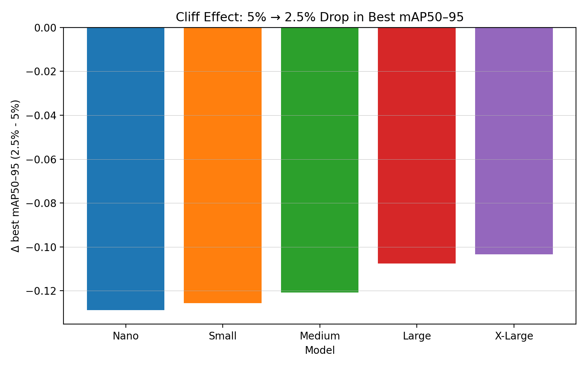
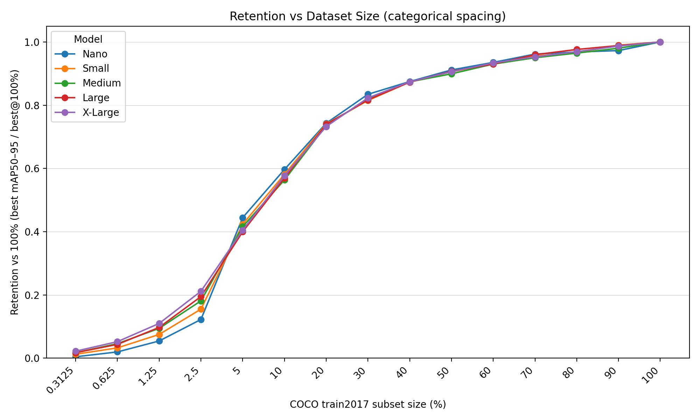
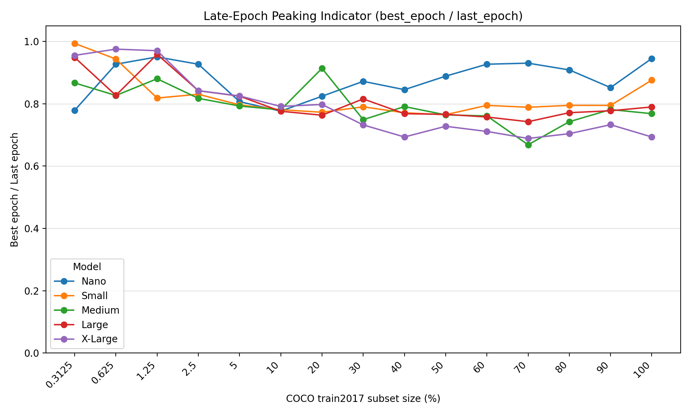

# YOLOv12 Small-Data Investigation  
### Full Analysis of Training YOLOv12 on Extremely Small COCO Subsets

---

## 📌 Project Overview

This repository presents a complete study of **how YOLOv12 behaves when trained on very small subsets of the COCO dataset**—from **0.3125% up to 100%** of COCO train2017.

The primary research goals were:

- to understand **how dataset size affects accuracy**,  
- to evaluate **stability of training** on extremely small datasets,  
- to compare **five YOLOv12 model sizes (n, s, m, l, x)**,  
- to measure **training time and convergence behavior**,  
- and to analyze **class distribution retention** under proportional subsampling.

All experiments were run on the **Leonardo Supercomputer**:

- 4 compute nodes  
- 4× GPUs per node  
- **16 GPUs total**  
- Distributed training via SLURM  

The full experimental pipeline — dataset creation, training scripts, subset analysis, and visualization — is included and fully reproducible.

---

# 📁 Dataset Construction

## Step 1 — Removing Empty Images

Before building any reduced dataset, we scanned the full COCO train2017 list and **removed all images with zero annotated objects**.

This ensures that proportional sampling does not select empty samples and maintains valid class statistics in every subset.

The cleaned image list was used as the base source for proportional subset generation.

---

## Step 2 — Subsampling Strategies

Each dataset percentage was generated using **three strategies**:

### 🔷 1. **Proportional (P)** — *Class-balanced subsampling (used for training)*  
This method preserves class proportions by sampling images so that every COCO class is represented according to the original class frequency.

```
train2017_<percent>_p.txt
```

This is the **main dataset type used for all YOLOv12 training** in this study.

---

### 🔶 2. Random  
Uniform random selection of images.

```
train2017_<percent>_random.txt
```

---

### 🔷 3. Top-N  
Takes the first N samples from the filtered COCO list.  
Not class-balanced, included only for comparison.

```
train2017_<percent>_topn.txt
```

---

## Step 3 — Available Dataset Sizes

The following dataset sizes were generated:

```
0.3125%, 0.625%, 1.25%, 2.5%, 5%, 10%, 20%, 30%, 40%, 50%, 60%, 70%, 80%, 90%, 100%
```

All subset files are located in:

```
datasets/
```

Additional aggregated class statistics are located here:

```
datasets/class_distribution.csv
```

---

# 📉 Dataset Analysis & Distribution Plots

Below are the main visualizations showing how the dataset shrinks at different scales.

### **Overall images & objects (Proportional / Random / Top-N)**


---

### **Per-Class Trends for Proportional Sampling**

These plots show how each of the 80 COCO classes is reduced proportionally.

#### 0–5% Range


#### 10–100% Range


---

# 🧪 YOLOv12 Training Experiments

We trained the following model sizes:

```
YOLOv12-n
YOLOv12-s
YOLOv12-m
YOLOv12-l
YOLOv12-x
```

Each model was trained on **all 15 dataset scales**, using the official YOLOv12 distributed training procedure.

Training logs are stored in:

```
small_data_logs/
```

---

# 📈 Training Behavior & Performance

## mAP5095 vs Epoch  
(Overview grid for all models across dataset sizes)


---

## Best mAP vs Dataset Size


---

# 📊 Final Results Summary
**Table: Best mAP50-95 values for each model and each dataset percentage**
|   Dataset % |   YOLOv12-n |   YOLOv12-s |   YOLOv12-m |   YOLOv12-l |   YOLOv12-x |
|-------------|-------------|-------------|-------------|-------------|-------------|
|      0.3125 |     0.00177 |     0.00585 |     0.00896 |     0.00912 |     0.01189 |
|      0.625  |     0.00793 |     0.01524 |     0.02366 |     0.02285 |     0.02798 |
|      1.25   |     0.02178 |     0.03515 |     0.0485  |     0.05101 |     0.05882 |
|      2.5    |     0.04893 |     0.07254 |     0.09322 |     0.10207 |     0.11329 |
|      5      |     0.17771 |     0.19822 |     0.21405 |     0.20958 |     0.21669 |
|     10      |     0.23863 |     0.27215 |     0.28986 |     0.29841 |     0.30878 |
|     20      |     0.29715 |     0.34674 |     0.37859 |     0.38737 |     0.39227 |
|     30      |     0.33377 |     0.38143 |     0.42123 |     0.4279  |     0.44073 |
|     40      |     0.34988 |     0.40865 |     0.44943 |     0.4575  |     0.46805 |
|     50      |     0.36457 |     0.42395 |     0.46249 |     0.47544 |     0.48505 |
|     60      |     0.37409 |     0.43547 |     0.47834 |     0.48741 |     0.49991 |
|     70      |     0.38462 |     0.44713 |     0.48865 |     0.50288 |     0.51019 |
|     80      |     0.38729 |     0.45238 |     0.4962  |     0.51158 |     0.519   |
|     90      |     0.38902 |     0.46326 |     0.50416 |     0.51805 |     0.52846 |
|    100      |     0.39996 |     0.46807 |     0.51434 |     0.52403 |     0.53549 |

Let’s discuss in depth the results presented in the table above.
First of all, as was expected, the precision of the inference gradually increases with the increase in dataset size, and generally, training on datasets smaller than the 5% mark results in unusable trained models. That being said, something truly interesting starts happening at a dataset size of 30% and above. The delta in the metric measurements between 30% and 100% drops below 10% across all models, meaning that supplying an additional 70% of the dataset only increases the mAP50–95 metric by 10%!
This is particularly interesting in data-scarce scenarios, where reaching a critical threshold of training data can lead to disproportionate performance gains. These results provide guidance for a clearer min-maxing strategy when training for a specific task, allowing data availability and cost to be balanced much more effectively.

# 📦 Repository Structure (Simplified)

```
yolov12_SmallData/
│
├── datasets/  
│   ├── train2017_<percent>_p.txt  
│   ├── train2017_<percent>_random.txt  
│   ├── train2017_<percent>_topn.txt  
│   └── class_distribution.csv
│
├── plots/
│   ├── datasets/    # Dataset distribution plots
│   └── train/       # Training curves and evaluation charts
│
├── small_data_logs/  # YOLOv12 training logs
└── README.md
```

---
## ⬜ TEMPLATE: Reproducing Official YOLO Results


## ⬜ Small-Data Results and Interpretation

This section summarizes how **YOLOv12 (n/s/m/l/x)** behaves as training data is reduced from **100%** of COCO train2017 down to **0.3125%** (proportional subsampling). Reported values correspond to **best mAP50–95** on COCO val.

---

## Overall trends

Across all five model sizes, **mAP50–95 increases monotonically** with dataset size, but the relationship is **strongly non-linear**. A reduction in dataset size by a factor of two does **not** imply a comparable reduction in detection quality.

**YOLOv12-x (example trajectory, best mAP50–95):**

- **100%:** 0.535  
- **50%:** 0.485 (≈ **90.6%** of full-data performance)  
- **20%:** 0.392 (≈ **73.3%**)  
- **10%:** 0.309 (≈ **57.7%**)  
- **5%:** 0.217 (≈ **40.5%**)  
- **2.5%:** 0.113 (≈ **21.2%**)  
- **1.25%:** 0.059 (≈ **11.0%**)  
- **0.625%:** 0.028 (≈ **5.2%**)  
- **0.3125%:** 0.012 (≈ **2.2%**)  

A similar shape appears for the other model sizes, with a relatively gentle decline at moderate fractions and a steep collapse in the extreme small-data tail.


---

## Interesting regimes

### Regime A — Diminishing returns at large data scales (≥50%)

From **50% → 100%**, absolute gains remain modest (on the order of **≈ +0.035 to +0.052** mAP50–95 depending on the model), and relative improvements are typically around **~9–10%**. This behavior is consistent with a large amount of redundant visual information at COCO scale once core modes of the data distribution are sufficiently covered.

### Regime B — Moderate degradation from 20% → 10% → 5%

Between **20%** and **5%**, performance decreases steadily but remains usable for all models. Two representative examples:

- **YOLOv12-l:** 0.387 → 0.298 → 0.210 (20% → 10% → 5%)  
- **YOLOv12-n:** 0.297 → 0.239 → 0.178 (20% → 10% → 5%)  

This region separates the “comfortable” data regime from the collapse regime and captures a practical operating range for cost–accuracy trade-offs.

### Regime C — Sharp collapse below ~5% (the “cliff”)

The transition **5% → 2.5%** marks the steepest drop across the sweep. The ratio of the 2.5% score to the 5% score is approximately:

- **x:** ~52% (0.217 → 0.113)  
- **l:** ~49% (0.210 → 0.102)  
- **m:** ~44% (0.214 → 0.093)  
- **s:** ~37% (0.198 → 0.073)  
- **n:** ~28% (0.178 → 0.049)  

Below **1.25%**, scores become very small for all models, indicating a data-insufficiency regime where stable generalization is not reliably achieved.



---

## Robustness by model size

Across dataset sizes, larger models (**l/x**) achieve the highest **absolute** mAP50–95. In the extreme small-data tail, larger models also retain a higher fraction of their full-data performance. For example at **2.5%**:

- **YOLOv12-x:** ≈ **21%** of its 100% performance  
- **YOLOv12-n:** ≈ **12%** of its 100% performance  

Near **5%**, **m/l/x** are relatively close, which is consistent with optimization noise becoming more visible as data becomes limiting.



---

## Why scaling is non-linear (hypotheses)

Several factors plausibly contribute to the observed non-linearity:

- **Redundancy in COCO:** many images share similar object appearances and contexts; once common patterns are learned, additional samples provide limited novelty, which aligns with diminishing returns at ≥50%.  
- **Architecture and inductive bias:** YOLO-style backbones and multi-scale heads can generalize from fewer examples once core visual features are established, flattening the curve at moderate fractions.  
- **Augmentation-driven effective data expansion:** standard augmentation pipelines can partially compensate for reduced data by increasing diversity in appearance and geometry, up to the point where the base dataset becomes too small.  
- **Mode coverage vs. class coverage:** proportional sampling preserves class ratios but does not guarantee coverage of rare *modes* (tiny objects, occlusions, crowded scenes). Missing these modes can disproportionately harm mAP50–95 and plausibly explains the cliff below ~5%.

---

## Training stability signal (late-epoch peaking)

A proxy for stability is the ratio **best_epoch / last_epoch**. Values closer to **1.0** correspond to best validation performance occurring near the end of training, which often accompanies higher variance and less stable convergence in extremely small-data regimes.



---

## Connection to the research questions

The experiments indicate that YOLOv12 remains **surprisingly robust** down to roughly **10–20%** of COCO under proportional sampling, while a clear threshold exists around **~5%** below which performance collapses rapidly and becomes near-unusable by **≤1.25%** when trained from scratch. Model scaling improves accuracy throughout the sweep and appears especially beneficial in the extreme low-data tail.

---

## Potential follow-up experiments

- A direct comparison of training outcomes for **proportional vs random vs top-N** subsets.  
- Multiple-seed repetitions in the **0.3125–5%** range to quantify variance and instability.  
- Per-class AP and **AP_small / AP_medium / AP_large** breakdowns to identify which failure modes dominate first.  
- Low-data recipe variants (training length, regularization, freezing strategy, augmentation strength) to test whether the cliff can be shifted.  
- Replication on other datasets/domains to determine whether the **~5%** threshold is COCO-specific.

---

# ⬜ Full Reproduction Guide

## 1️⃣ Downloading and Preparing COCO

Download COCO 2017 (train/val images + annotations) into a directory of your choice (this directory will be used as `path:` in YOLO YAMLs).

```bash
COCO_DIR=/path/to/coco
mkdir -p "$COCO_DIR" && cd "$COCO_DIR"

wget -c http://images.cocodataset.org/zips/train2017.zip
wget -c http://images.cocodataset.org/zips/val2017.zip
wget -c http://images.cocodataset.org/annotations/annotations_trainval2017.zip

unzip -q train2017.zip
unzip -q val2017.zip
unzip -q annotations_trainval2017.zip
```

## 2️⃣ Creating YAML Training Configs  
Generate one YOLO dataset YAML per subset list file using:

- Script: `scripts/generate_lowdata_yamls.py`

Run:
```bash
python scripts/generate_lowdata_yamls.py \
  --coco-path /path/to/coco \
  --lists-dir ./datasets \
  --out-dir ./configs/LowData/Datasets \
  --val val2017.txt \
  --test test-dev2017.txt
```

Each YAML will have the form:
```yaml
path: /path/to/coco
train: train2017_0.625_p.txt
val: val2017.txt
test: test-dev2017.txt

# Classes
names:
  0: person
  ...
  79: toothbrush
```

## 3️⃣ Generating SLURM Training Scripts  
Generate SLURM job scripts from a template using:

- Script: `scripts/generate_slurm_jobs.py`

Run:
```bash
python scripts/generate_slurm_jobs.py \
  --yamls-dir ./configs/LowData/Datasets \
  --out-dir ./slurm/jobs \
  --logs-root ./run_logs/LowData \
  --partition <your_partition> \
  --time 04:00:00 \
  --nodes 4 \
  --gpus-per-node 4 \
  --cpus-per-task 8 \
  --run-cmd "python -u /path/to/train.py"
```

## 4️⃣ Launching Training on Leonardo  
Submit one job:
```bash
sbatch slurm/jobs/coco_10_p.slurm
```

Submit all jobs:
```bash
for f in slurm/jobs/*.slurm; do sbatch "$f"; done
```

SLURM stdout/stderr logs will be written under:
```text
run_logs/LowData/<experiment_name>_<jobid>/
```

---

# 🙌 Acknowledgements

- **Leonardo Supercomputer** — for HPC compute resources  
- **YOLOv12 Research Team** — for model architecture & training code  
- **COCO Consortium** — for dataset availability  
- Everyone who contributed to distributed training and analysis  
